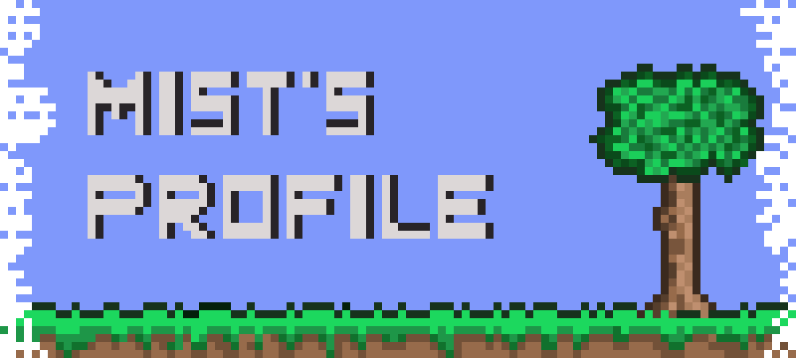
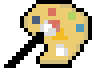

<h1>Mist's profile</h1>

  

  
  

    
  

 
 
  <table>
    <tr>
      <td>
      

          
          <H2>ID Card</H2>
        

Hi, I'm Mist, a developer from Chengdu, China with more than 6 years of experience. Currently, I'm working on blockchain projects, but I'm always open to new ideas. I'm a big fan of TypeScript, as well as Rust, Haskell, and Go. I also love functional programming.
 
         
I have a passion for programming language and framework design, and I have plans to create my own programming language called Mist. However, I haven't started the project yet, so there's nothing to show for it. If you're interested in this project, please feel free to contact me.

  
 

<H2>Life Style</H2>

        
        
        
And I'm also a big fan of pixel art, abstract reality, and drawing on paper. Pixel art is a cool way to express how you see things, and I find it fascinating.

Currently, in addition to creating pixel art, I'm working hard on Kickflip. If you have any tips, please let me know! 🙏

      </td>
      <td>

      </td>
    </tr>
  </table>

  
  

<!-- 
  

  
  
   -->

<!-- 

    Hii there, welcome to Mist's profile, have a happy landing. My name is Mist, an WEB developer from ChengDu, I'm working on blockchain wallet currently, and Mist is also name of an Ethereum wallet. Actually coding already is a important part of my life, nowdays, I'd love to spend most of my free time at <a href="https://github.com/wizardoc/wizard">Wizardoc</a>. I'm really happy to hava a chat with u about interesting technical topic, looking forward to your email.
  
 -->

